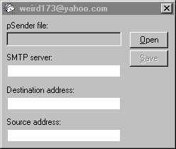

# Kuang2 - Trojan

🤷‍♂️ Some code I wrote long time ago... for fun and non-profit.

🚀 Pull Requests & contributions are welcomed!

💜 Enjoy

🦠 Looking for a [virus](https://github.com/igr/kuang2-virus) instead?

## Weird.pSender

Windows trojan horse that sends DialUp Internet passwords from infected computer to the user. Detects password changes and resends email with new data.

